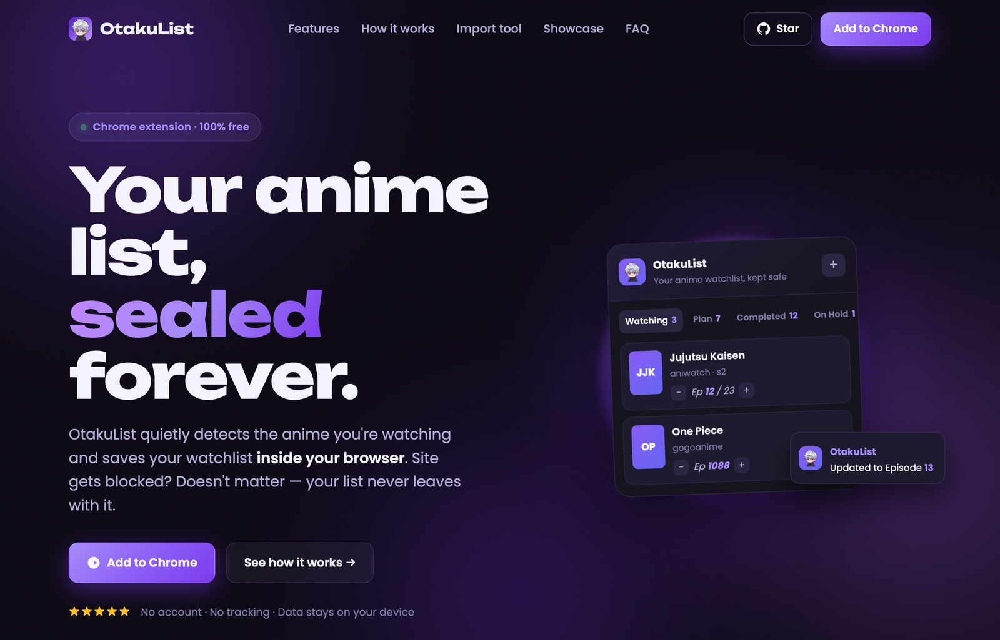

<p align="center">
  
</p>

<h1 align="center">OtakuList</h1>

<p align="center">
  <b>Your anime watchlist, kept safe locally — even when a site gets blocked.</b>
</p>

<p align="center">
  
  
  
  
</p>

<p align="center">
  <a href="https://shabanmughal.github.io/OtakuList/"><b>Website</b></a> ·
  <a href="#-install-unpacked"><b>Install</b></a> ·
  <a href="#️-how-to-use-it"><b>How it works</b></a> ·
  <a href="#-gacha-showcase-companion-web-app"><b>Gacha Showcase</b></a>
</p>

<p align="center">
  <a href="https://shabanmughal.github.io/OtakuList/">
    
  </a>
</p>

---

## 📖 What is it?

**OtakuList** is a browser extension for anime watchers who hop between streaming/mirror
sites. It **automatically detects the anime you're watching**, reads the title and
episode, and saves it to a watchlist that lives **inside your browser**.

The problem it solves: pirate/mirror sites get blocked or disappear all the time, and
when they do, you lose track of *what you were watching* and *what's next*. OtakuList
keeps that list with you — not on the site — so it never disappears with the site.

- 🔒 **Local & private watchlist** — your list stays in your browser, never uploaded.
- 🤖 **Auto-detects** the anime, episode, and cover art as you watch.
- 🖼️ **Real cover art** — posters pulled from [AniList](https://anilist.co), not the site's random banner.
- 🔗 **One entry per anime** — the same show on a different site updates your existing entry instead of duplicating it.
- ⚡ **Zero effort** — episodes update themselves while you binge.

There's also an **optional companion web app** — the [Gacha Showcase](#-gacha-showcase-companion-web-app) —
for building a public profile of your gacha-game accounts. It's completely separate from
your private watchlist. [Jump to it ↓](#-gacha-showcase-companion-web-app)

---

## ✨ Features

### 🧩 The extension (anime watchlist)

| | |
|---|---|
| 🎯 **Auto-detection** | Open an episode and a card slides in with the detected title + episode — one tap to save. |
| 🖼️ **AniList cover art** | Fetches the anime's real poster from AniList's public API, so covers are correct even when a site has none. |
| 🔗 **Cross-site dedup** | Recognizes the same anime across different sites (via its canonical AniList id) and keeps a single entry. |
| 🗂️ **Clean lists** | Sorted into **Watching · Plan to Watch · Completed · On Hold** with a search box. |
| 🔢 **Episode tracking** | Bumps your episode count automatically as you move through a series — silently. |
| 📌 **Toolbar badge** | A live count of how many anime you're currently watching. |
| ✍️ **Manual add** | Missed by detection? Add any title, status, and episode by hand. |
| 🌐 **Web sync bridge** | The official OtakuList site can read your local list (for the *Create list* / *Import* pages) — gated to the official domain + localhost. |

---

## 🚀 Install (unpacked)

1. Open `chrome://extensions` (or `edge://extensions`, `brave://extensions`).
2. Turn on **Developer mode** (top-right toggle).
3. Click **Load unpacked** and select this `extention` folder.
4. Pin the **OtakuList** icon to your toolbar — done! 🎉

> Works on Chrome, Edge, Brave, and other Chromium browsers.

---

## 🕹️ How to use it

**1. Just watch.**
Open any anime episode on any site. OtakuList notices you're on a watch page and a
small card appears at the bottom-right with the detected **title + episode**.

**2. Save it once.**
Tap **▶ Watching** or **＋ Plan to watch**. You can fix the title first if the
detection got it slightly wrong.

**3. It tracks itself.**
Once an anime is in **Watching**, moving to the next episode updates your progress
automatically — you'll see a tiny *"Updated to Episode X"* toast, no interruptions.

**4. Manage your list.**
Click the toolbar icon to open the dashboard:
- Switch between **Watching / Plan / Completed / On Hold** tabs
- Use **− / +** to adjust the episode number
- Change an anime's **status** from the dropdown
- **Search** your list, open the source site, or **delete** an entry
- Hit **＋** to add something manually

---

## 🎴 Gacha Showcase (companion web app)

A separate, **optional** website for showing off your gacha-game accounts — completely
independent of your private anime watchlist.

- 🕹️ **Public profiles** for **Genshin Impact · Honkai: Star Rail · Zenless Zone Zero · Wuthering Waves** — pick your characters, add ranks/UIDs.
- 🔑 **Sign in with Google** (or email/password) — powered by [Supabase](https://supabase.com).
- 🖼️ **Profile picture** pulled automatically from your Google account.
- 🔗 **Your own public link** — pick a username and share `?u=yourname`.
- ❤️ **Likes** and **featured characters** on each profile.
- 🌐 Reads your extension's watchlist (via the web sync bridge) on the *Create list* / *Import* pages.

Built with **Astro + Tailwind CSS + Supabase**.

### Run it locally

```bash
cd web
npm install
cp .env.example .env     # add your Supabase URL + anon key
npm run dev              # http://localhost:4321
```

- Database schema + row-level-security lives in [`supabase/`](supabase/) — see
  [`supabase/README.md`](supabase/README.md) for the migrations to run.
- To enable **Sign in with Google**, add a Google OAuth client and paste its
  Client ID/Secret into your Supabase project (Authentication → Providers → Google),
  then allow your site URLs under Authentication → URL Configuration.

---

## ⚠️ Good to know

- **Detection is a smart guess.** Every site is built differently, so OtakuList reads
  the page's title, URL, and `og:` metadata (and looks the anime up on AniList). It
  catches most sites, and the save card always lets you correct the title. Anything it
  misses, add manually with **＋**.
- **It stays out of the way.** It ignores search engines and general sites — only real
  anime *watch* and *detail* pages trigger it. Searching "anime" on Google won't pop
  anything up.
- **Your watchlist is local.** It lives in this browser profile; uninstalling the
  extension or wiping the browser clears it. Cover art / identity lookups query
  AniList's **public** API using only the *current* anime's title or id — your list is
  never uploaded.
- **The Showcase is opt-in and separate.** It's the only part that uses an account, and
  it never touches your private watchlist.

---

## 📁 Project structure

```
extention/
├── manifest.json          Extension config (Manifest V3)
├── src/
│   ├── background.js       Toolbar badge + AniList cover/identity resolver
│   ├── content.js          Auto-detection, cover/dedup, in-page save card & toast
│   └── popup.html/css/js    The dashboard UI
├── icons/                  App icons + logo
├── fonts/                  Poppins (bundled locally)
├── web/                    Companion web app (Astro + Tailwind + Supabase)
│   ├── src/pages/          Landing, Create list, Import, Gacha Showcase
│   └── public/             Static JS/data (character rosters, etc.)
├── supabase/               DB schema + RLS for Showcase accounts
└── docs/                   Published static site (GitHub Pages)
```

---

<p align="center"><sub>Made for anime fans. Your list, kept safe locally. 🍥</sub></p>
